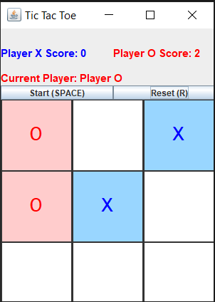

# swing-tictactoe
A Simple JAVA Game that demonstrates how different kinds of events are implemented with Swing

### Features
 - 2 player game (human)
 - can be play with mouse only
 - can be play with keyboard only
 - score
 - designated color for each player

### Screenshot

## LICENSE 
[Apache-2.0](https://www.apache.org/licenses/LICENSE-2.0)[@eru123](https://github.com/eru123)
